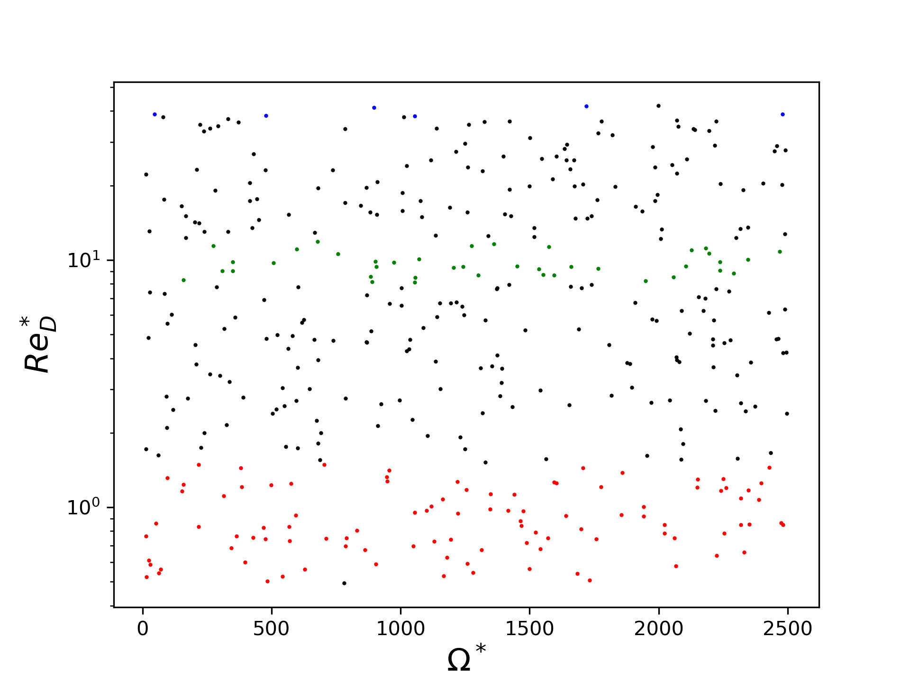
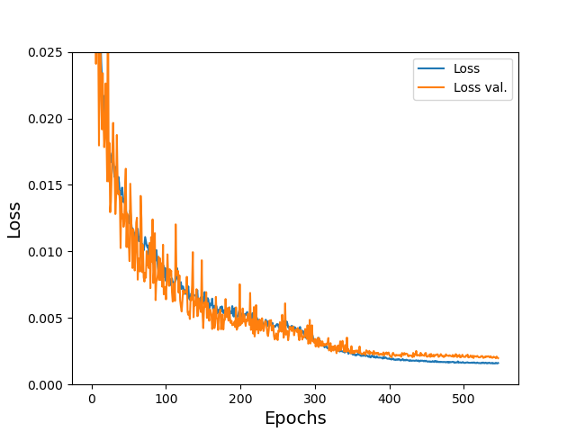
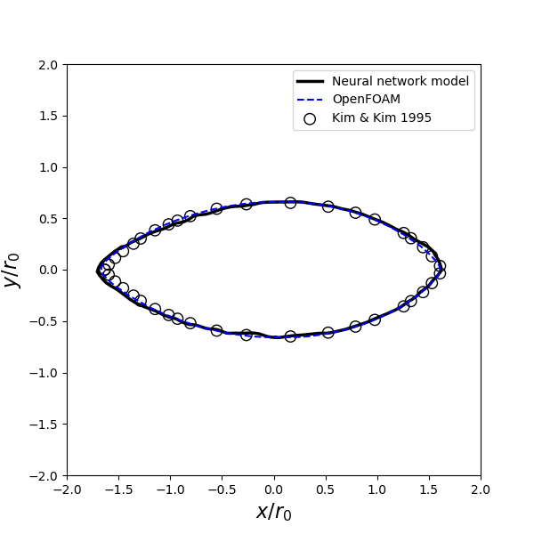
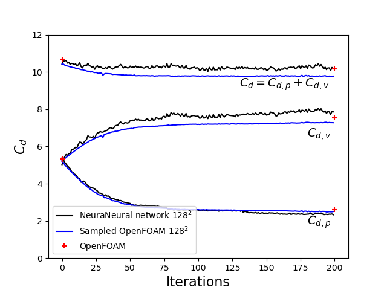
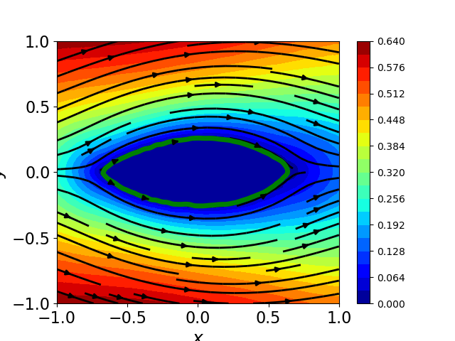

# dl-surrogates
This is the source code repository for the paper "Numerical investigation of minimum drag profiles in laminar flow using deep learning surrogates" by Chen, Cakal, Hu and Thuerey, Journal of Fluid Mechanics, Volume 919, A34, 2021 (see: https://doi.org/10.1017/jfm.2021.398 or the manuscript on arXiv: https://arxiv.org/abs/2009.14339)

# Abstract: 
Efficiently predicting the flow field and load in aerodynamic shape optimisation remains a highly challenging and relevant task. Deep learning methods have been of particular interest for such problems, due to their success in solving inverse problems in other fields. In the present study, U-net-based deep neural network (DNN) models are trained with high-fidelity datasets to infer flow fields, and then employed as surrogate models to carry out the shape optimisation problem, i.e. to find a minimal drag profile with a fixed cross-sectional area subjected to a two-dimensional steady laminar flow. A level-set method as well as Bézier curve method are used to parameterise the shape, while trained neural networks in conjunction with automatic differentiation are utilised to calculate the gradient flow in the optimisation framework. The optimised shapes and drag force values calculated from the flow fields predicted by the DNN models agree well with reference data obtained via a Navier–Stokes solver and from the literature, which demonstrates that the DNN models are capable not only of predicting flow field but also yielding satisfactory aerodynamic forces. This is particularly promising as the DNNs were not specifically trained to infer aerodynamic forces. In conjunction with a fast runtime, the DNN-based optimisation framework shows promise for general aerodynamic design problems.


# Tutorial:
## Dataset
To genereate flow fields in a range of Reynolds numbers (e.g. from 0.5 to c.a. 40), we used the open-source CFD solver "OpenFOAM". 
To have a quick start, we provided a small dataset (400 samples) in the folder "datasets". The distribution of data points looks like this:



```
cat dataset-ranged-400.tar.bz2.parta* > dataset-ranged-400.tar.bz2
tar -xjf dataset-ranged-400.tar.bz2
```
Then flow samples are then in "dl-surrogates/datasets/dataset-ranged-400". (File format: *.npz)

*(The dataset-8640 can be downloaded from: https://dataserv.ub.tum.de/index.php/s/m1616559)*

## Train the deep-learning surrogate model
Go to folder "dl-surrogates/shape-opt/train/". Run:
```
python runTrain.py
```
Model is trained over 500 epochs and then we can plot the training history files "L1.txt" and "L1val.txt":



The model file is obtained: "modelG" (Note: this is a large-scale NN with 30905859 trainable parameters, c.a. 124MB). In addition, two pickle files are also generated: "max_inputs.pickle" and "max_targets.pickle". We provided these three files in the pre-trained model folder: "dl-surrogates/models/dataset-ranged-400/"


## Optimisation
Go to folder "dl-surrogates/shape-opt/levelset/". 
The model actuall works well for Reynolds number range from 1 to 40. Here, we only take the case of the minimal drag profile at Re=1 for example.
In the file "Constants.py", we specified the folder where the model file and pickle files are: 

modelPath='../../models/dataset-ranged-400'

modelName='modelG_dataset-ranged-400'

The, we run: 
```
python main_Deep_gpu_v4.py
```
After 200 iterations, we will see the geometry files have been generated (i.e. "SQ_*.dat"). We can plot the final geometry and compare it with Ref. History of drag is saved in the file "history.npz".





Level set function "phi" is saved in the file "phi.pt.saved". Rename it as "phi.pt" if one wants to continue running from it. The flow field (i.e. velocity-X) with streamlines can be plot:



## Bezier-curve-based optimisation
*The tutorial and code will come up soon*